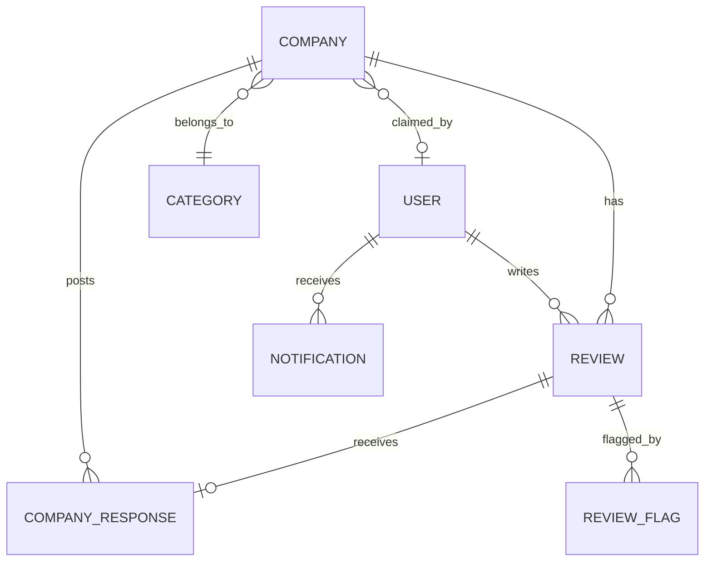

# TruthBoard — Database Schema Plan

## Collections Overview



---

## 1. Users Collection

```
users {
  _id:              ObjectId
  name:             String        (required, 2–50 chars)
  email:            String        (required, unique, lowercase, trimmed)
  password:         String        (required, hashed with bcrypt)
  avatar:           String        (URL, default placeholder)
  role:             String        (enum: "user", "companyOwner", "admin", default: "user")
  isVerified:       Boolean       (default: false — email verification)
  bio:              String        (max 500 chars)
  location:         String
  reviewCount:      Number        (default: 0, denormalized counter)
  createdAt:        Date
  updatedAt:        Date
}

Indexes:
  - { email: 1 }         unique
  - { role: 1 }
  - { createdAt: -1 }
```

---

## 2. Companies Collection

```
companies {
  _id:              ObjectId
  name:             String        (required, unique, 2–100 chars)
  slug:             String        (required, unique, auto-generated from name)
  website:          String        (URL)
  logo:             String        (URL)
  category:         ObjectId      (ref: Category)
  description:      String        (max 2000 chars)
  claimedBy:        ObjectId      (ref: User, nullable — company owner)
  isClaimed:        Boolean       (default: false)
  contactEmail:     String

  // Denormalized rating data (updated on each review change)
  averageRating:    Number        (default: 0, 1 decimal place)
  totalReviews:     Number        (default: 0)
  ratingDistribution: {
    1: Number       (default: 0)
    2: Number       (default: 0)
    3: Number       (default: 0)
    4: Number       (default: 0)
    5: Number       (default: 0)
  }
  trustScore:       Number        (0–100, weighted score)

  createdAt:        Date
  updatedAt:        Date
}

Indexes:
  - { slug: 1 }            unique
  - { name: "text" }       text index for search
  - { category: 1 }
  - { averageRating: -1 }
  - { totalReviews: -1 }
  - { trustScore: -1 }
  - { createdAt: -1 }
```

---

## 3. Reviews Collection

```
reviews {
  _id:              ObjectId
  userId:           ObjectId      (ref: User, required)
  companyId:        ObjectId      (ref: Company, required)
  rating:           Number        (required, 1–5 integer)
  title:            String        (required, 5–100 chars)
  reviewText:       String        (required, 10–5000 chars)
  dateOfExperience: Date          (required)

  // Moderation
  status:           String        (enum: "published","pending","rejected","removed", default: "published")
  isEdited:         Boolean       (default: false)
  editHistory:      [{
    title:          String
    reviewText:     String
    rating:         Number
    editedAt:       Date
  }]

  // AI Sentiment
  sentimentScore:   Number        (0–1, set by AI service)
  isNegativeFlagged:Boolean       (default: false)

  // Verification
  isVerified:       Boolean       (default: false — verified purchase/interaction)

  // Flags
  flagCount:        Number        (default: 0)

  createdAt:        Date
  updatedAt:        Date
}

Indexes:
  - { companyId: 1, createdAt: -1 }     compound — reviews by company sorted by date
  - { userId: 1, createdAt: -1 }        compound — reviews by user sorted by date
  - { companyId: 1, rating: 1 }         compound — filtering by rating per company
  - { status: 1 }
  - { isNegativeFlagged: 1 }
  - { sentimentScore: 1 }
  - unique constraint: { userId: 1, companyId: 1 } — one review per user per company
```

---

## 4. Categories Collection

```
categories {
  _id:              ObjectId
  name:             String        (required, unique)
  slug:             String        (required, unique)
  icon:             String        (emoji or icon class)
  companyCount:     Number        (default: 0, denormalized)
  createdAt:        Date
}

Indexes:
  - { slug: 1 }     unique
  - { name: 1 }     unique
```

---

## 5. Company Responses Collection

```
companyResponses {
  _id:              ObjectId
  reviewId:         ObjectId      (ref: Review, required, unique — one response per review)
  companyId:        ObjectId      (ref: Company, required)
  responderId:      ObjectId      (ref: User, required — must be company owner)
  responseText:     String        (required, 10–2000 chars)
  createdAt:        Date
  updatedAt:        Date
}

Indexes:
  - { reviewId: 1 }      unique
  - { companyId: 1 }
```

---

## 6. Review Flags Collection

```
reviewFlags {
  _id:              ObjectId
  reviewId:         ObjectId      (ref: Review, required)
  flaggedBy:        ObjectId      (ref: User, required)
  reason:           String        (enum: "spam","inappropriate","fake","offensive","other")
  description:      String        (max 500 chars)
  status:           String        (enum: "pending","reviewed","dismissed", default: "pending")
  resolvedBy:       ObjectId      (ref: User — admin who resolved)
  resolvedAt:       Date
  createdAt:        Date
}

Indexes:
  - { reviewId: 1, flaggedBy: 1 }    unique — one flag per user per review
  - { status: 1 }
```

---

## 7. Notifications Collection

```
notifications {
  _id:              ObjectId
  recipientId:      ObjectId      (ref: User, required)
  type:             String        (enum: "negative_review","new_review","review_response",
                                         "review_flagged","review_moderated","system")
  title:            String        (required)
  message:          String        (required)
  isRead:           Boolean       (default: false)

  // Contextual references
  reviewId:         ObjectId      (ref: Review, nullable)
  companyId:        ObjectId      (ref: Company, nullable)

  createdAt:        Date
}

Indexes:
  - { recipientId: 1, isRead: 1, createdAt: -1 }    compound — unread notifications sorted
  - { recipientId: 1, createdAt: -1 }
```

---

## Relationships Summary

| From              | To                | Type         | Field           |
|-------------------|-------------------|--------------|-----------------|
| Review            | User              | Many → One   | userId          |
| Review            | Company           | Many → One   | companyId       |
| Company           | Category          | Many → One   | category        |
| Company           | User (owner)      | One → One    | claimedBy       |
| CompanyResponse   | Review            | One → One    | reviewId        |
| CompanyResponse   | Company           | Many → One   | companyId       |
| ReviewFlag        | Review            | Many → One   | reviewId        |
| ReviewFlag        | User (flagger)    | Many → One   | flaggedBy       |
| Notification      | User (recipient)  | Many → One   | recipientId     |
| Notification      | Review            | Many → One   | reviewId        |
| Notification      | Company           | Many → One   | companyId       |

---

## Denormalization Strategy

To avoid expensive aggregation queries on every page load:

1. **Company.averageRating / totalReviews / ratingDistribution** — updated on every review create, edit, or delete via a utility function.
2. **Company.trustScore** — recalculated when reviews change; uses weighted algorithm.
3. **User.reviewCount** — incremented/decremented on review create/delete.
4. **Category.companyCount** — updated when companies are added/removed from a category.
